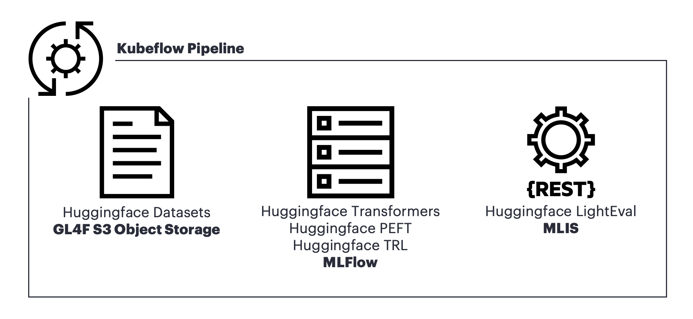

# HPE PCAI PEFT example
This example demonstrate How to finetune the LLM in the PCAI. This example does not focus on Finetuning itself, but How to *finetune with AI Essentials Softwares in PCAI*.

## Contents
- AIE1.8 : Include Jupyter Notebooks and Kubeflow Pipeline code validated in AIE1.8.
- AIE1.10 : Include Jupyter Notebooks and Kubeflow Pipeline code validated in AIE1.10.
- build_image : Include resources used to build Kubeflow pipeline component container image.

## Core AI Essentials Components
### MLflow
MLflow is an open-source platform, purpose-built to assist machine learning practitioners and teams in handling the complexities of the machine learning process.
### Kubeflow Pipeline
Kubeflow Pipelines (KFP) is a platform for building and deploying portable and scalable machine learning (ML) workflows using containers on Kubernetes-based systems.
### MLIS 
HPE Machine Learning Inference Software (MLIS) is a user-friendly solution designed to simplify and control the deployment, management, and monitoring of machine learning (ML) models at any scale. 

## Core Frameworks
### Datasets
The Hugging Face Datasets library is a versatile and easy-to-use Python library designed to simplify accessing, sharing, and processing datasets for machine learning tasks in NLP, computer vision, and audio.
### Transformers
Transformers acts as the model-definition framework for state-of-the-art machine learning models in text, computer vision, audio, video, and multimodal model, for both inference and training. It centralizes the model definition so that this definition is agreed upon across the ecosystem.
### PEFT
PEFT (Parameter-Efficient Fine-Tuning) is a library for efficiently adapting large pretrained models to various downstream applications without fine-tuning all of a model’s parameters because it is prohibitively costly
### TRL
TRL is a full stack library where we provide a set of tools to train transformer language models with methods like Supervised Fine-Tuning (SFT), Group Relative Policy Optimization (GRPO), Direct Preference Optimization (DPO), Reward Modeling, and more. 
### LightEval
Lighteval is your all-in-one toolkit for evaluating Large Language Models (LLMs) across multiple backends with ease. Dive deep into your model’s performance by saving and exploring detailed, sample-by-sample results to debug and see how your models stack up.